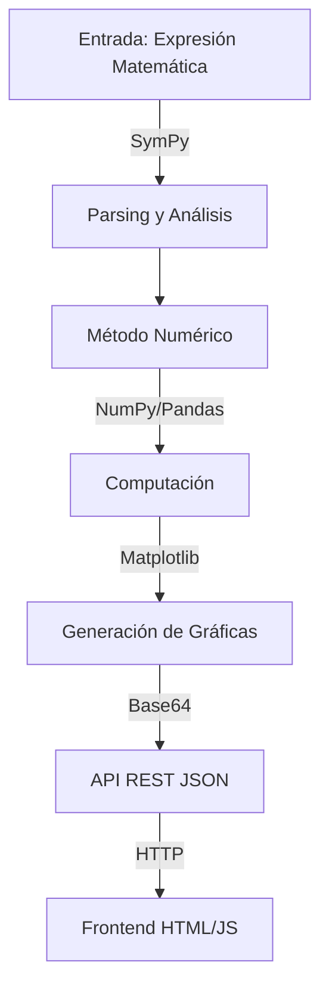
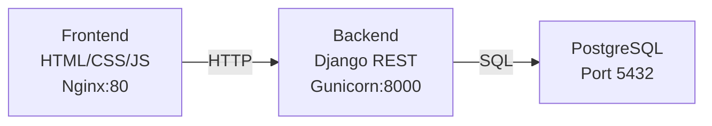
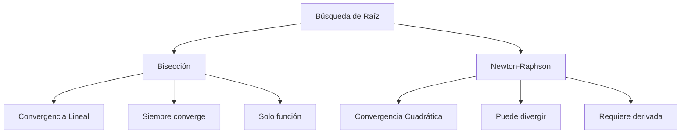
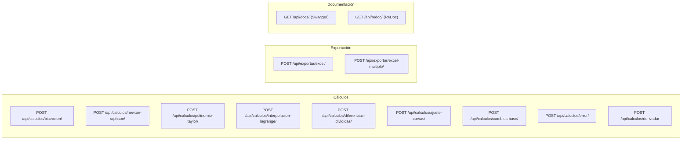
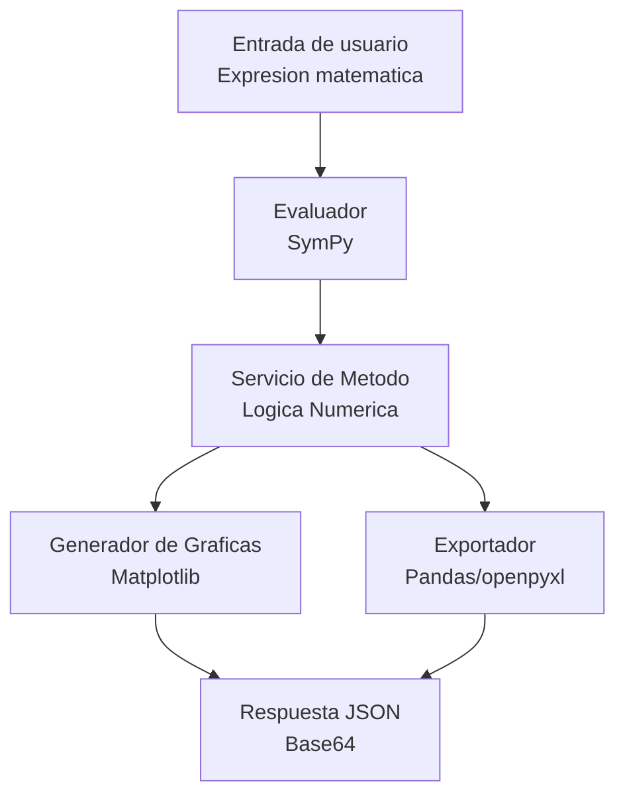
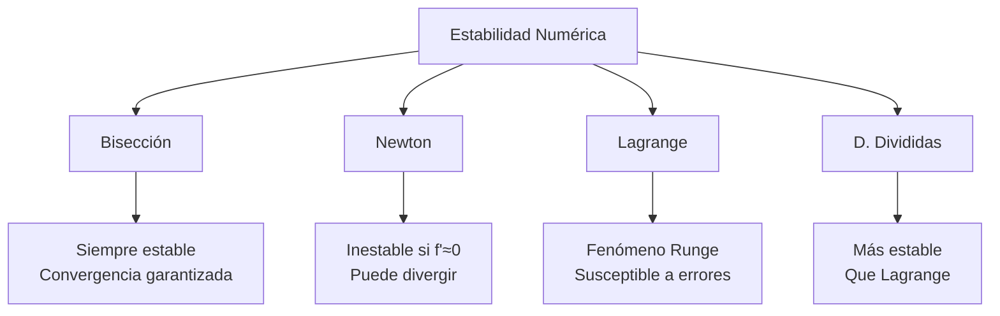
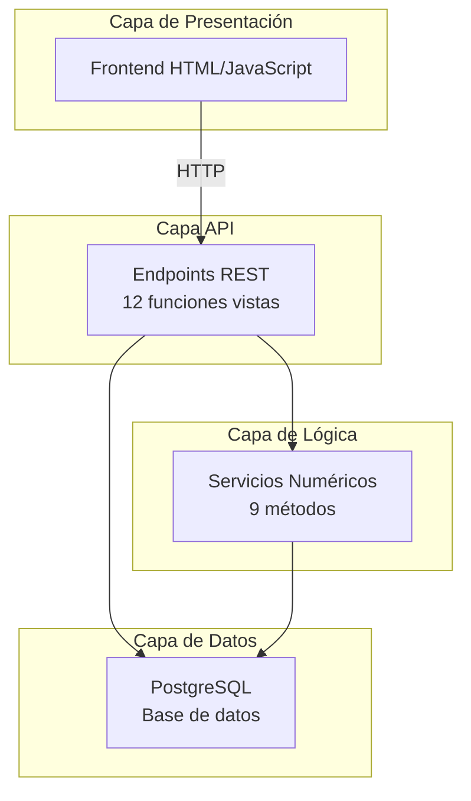

# Calculadora de Métodos Numéricos

Aplicación web completa que implementa **9 métodos numéricos** para resolución de problemas matemáticos comunes en análisis numérico. Backend REST API con Django + PostgreSQL, frontend HTML/JavaScript, y orquestación Docker.

---

## Descripción General

Esta aplicación procesa **expresiones matemáticas simbólicas**, las evalúa numéricamente y retorna resultados junto con:
- Visualizaciones gráficas en formato PNG (codificadas en base64)
- Historial detallado de iteraciones
- Exportación de datos a Excel

### Características Principales



---

## Arquitectura del Proyecto



### Stack Tecnológico

| Capa | Tecnología | Versión | Función |
|------|------------|---------|---------|
| **Backend** | Django + DRF | 4.2.13 + 3.14.0 | API REST |
| **Procesamiento** | SymPy | 1.12 | Álgebra simbólica |
| **Numeración** | NumPy | 1.24.3 | Operaciones numéricas |
| **Gráficas** | Matplotlib | 3.7.2 | Visualización PNG |
| **Datos** | Pandas + openpyxl | 2.0.3 + 3.1.2 | Exportación Excel |
| **Base de Datos** | PostgreSQL | 15 | Persistencia |
| **Orquestación** | Docker Compose | - | Containerización |

---

## Métodos Matemáticos Implementados

### Método de Bisección

**Propósito:** Encontrar una raíz real de $f(x) = 0$ en $[a, b]$

**Teoría Matemática:**

El método se basa en el **Teorema de Bolzano**: si $f$ es continua en $[a, b]$ y $f(a) \cdot f(b) < 0$, entonces existe $c \in (a, b)$ tal que $f(c) = 0$.

**Algoritmo:**

$$p_n = \frac{a_n + b_n}{2} \quad \text{(punto medio)}$$

En cada iteración se reduce el intervalo:

$$\text{Si } f(a_n) \cdot f(p_n) < 0 \implies [a_{n+1}, b_{n+1}] = [a_n, p_n]$$
$$\text{Si } f(a_n) \cdot f(p_n) > 0 \implies [a_{n+1}, b_{n+1}] = [p_n, b_n]$$

**Error Relativo:**

$$E_{\text{rel}} = \frac{|x_{n+1} - x_n|}{|x_{n+1}|} < \varepsilon$$

**Características:**
- Convergencia garantizada
- Complejidad: $O(\log((b-a)/\varepsilon))$
- Generación dual: gráfica de función + convergencia del error

---

### Método de Newton-Raphson

**Propósito:** Encontrar raíces con convergencia cuadrática

**Fórmula de Recurrencia:**

$$x_{n+1} = x_n - \frac{f(x_n)}{f'(x_n)}$$

**Interpretación Geométrica:** La tangente a $f$ en $(x_n, f(x_n))$ intersecta el eje $x$ en $x_{n+1}$.

**Derivada Simbólica:**

$$f'(x) = \frac{d}{dx}[f(x)] \quad \text{(calculada por SymPy)}$$

**Convergencia Cuadrática:**

$$|e_{n+1}| \approx C \cdot |e_n|^2$$

**Condiciones:**
- $f'(x_0) \neq 0$
- Error relativo: $\frac{|x_{n+1} - x_n|}{|x_{n+1}|} < \varepsilon$

**Comparativa con Bisección:**



---

### Polinomio de Taylor

**Propósito:** Aproximar $f(x)$ mediante un polinomio de grado $n$ alrededor del punto $c$

**Serie de Taylor:**

$$P_n(x) = \sum_{k=0}^{n} \frac{f^{(k)}(c)}{k!}(x - c)^k$$

**Propiedades:**
- Coincide en el punto: $P_n(c) = f(c)$
- Derivadas coinciden: $P_n^{(k)}(c) = f^{(k)}(c)$ para $k = 0, 1, \ldots, n$

**Error de Aproximación:**

$$|f(x) - P_n(x)| \leq \frac{M_{n+1}}{(n+1)!}|x - c|^{n+1}$$

donde $M_{n+1}$ es una cota de $|f^{(n+1)}(t)|$ en el intervalo.

**Salida:**
- Valor exacto $f(x_0)$
- Valor aproximado $P_n(x_0)$
- Error absoluto y relativo
- Gráfica comparativa

---

### Interpolación de Lagrange

**Propósito:** Encontrar polinomio que pasa por puntos $(x_i, y_i)$

**Polinomio de Lagrange de Grado $n-1$:**

$$P(x) = \sum_{i=0}^{n-1} y_i \cdot L_i(x)$$

**Base de Lagrange:**

$$L_i(x) = \prod_{j=0, j \neq i}^{n-1} \frac{x - x_j}{x_i - x_j}$$

**Propiedades:**
- Pasa exactamente por todos los puntos: $P(x_i) = y_i$
- Único de grado mínimo que interpola los puntos
- Complejidad: $O(n^2)$

**Desventajas:**
- Fenómeno de Runge: oscilaciones en extremos
- Inestabilidad con puntos muy cercanos

---

### Diferencias Divididas de Newton

**Propósito:** Interpolación con actualizaciones incrementales

**Polinomio de Newton:**

$$P(x) = c_0 + c_1(x-x_0) + c_2(x-x_0)(x-x_1) + \cdots$$

**Tabla de Diferencias Divididas:**

$$\begin{array}{c|c|c|c}
x_i & f[x_i] & f[x_i, x_{i+1}] & f[x_i, x_{i+1}, x_{i+2}] \\
\hline
x_0 & y_0 & \frac{y_1-y_0}{x_1-x_0} & \cdots \\
x_1 & y_1 & \frac{y_2-y_1}{x_2-x_1} & \cdots \\
x_2 & y_2 & \cdots & \\
\end{array}$$

**Ventajas vs Lagrange:**
- Actualización incremental (agregar punto = una fila más)
- Mejor estabilidad numérica
- Coeficientes directos
- Complejidad: $O(n^2)$ vs $O(n^3)$ Lagrange

---

### Ajuste de Curvas por Mínimos Cuadrados

**Propósito:** Encontrar la curva que mejor aproxima puntos dispersos

**Criterio de Optimización:**

Minimizar: $S = \sum_{i=1}^{m} (y_i - \hat{y}_i)^2$

#### a) Ajuste Polinómico de Grado $n$

$$y = a_0 + a_1x + a_2x^2 + \cdots + a_nx^n$$

Resuelve sistema normal: $(X^T X) \mathbf{a} = X^T \mathbf{y}$

#### b) Ajuste Exponencial

**Modelo:** $y = ae^{bx}$

**Transformación logarítmica:** $\ln(y) = \ln(a) + bx$

Se resuelve como regresión lineal en escala log.

#### c) Ajuste Logarítmico

**Modelo:** $y = a + b\ln(x)$ (requiere $x > 0$)

**Métricas de Bondad:**

| Métrica | Fórmula | Interpretación |
|---------|---------|----------------|
| $R^2$ | $1 - \frac{SSR}{SST}$ | $R^2 = 1$: ajuste perfecto |
| RMSE | $\sqrt{\frac{SSR}{n}}$ | Error medio cuadrático |
| $s$ | $\sqrt{\frac{SSR}{n-2}}$ | Desviación estándar residuos |

---

### Cálculos Auxiliares

#### Cálculo de Errores

$$E_{\text{abs}} = |x_{\text{verdadero}} - x_{\text{aprox}}|$$

$$E_{\text{rel}} = \frac{E_{\text{abs}}}{|x_{\text{verdadero}}|}$$

$$E_{\text{pct}} = E_{\text{rel}} \times 100\%$$

#### Derivadas Simbólicas

Cálculo exacto mediante SymPy:

$$\frac{d}{dx}[x^2 + 3x] = 2x + 3$$

#### Cambios de Base

Conversion entre bases $2 \to 36$:
- Base N a Base 10: evaluación polinómica
- Base 10 a Base N: algoritmo división/multiplicación

---

## Endpoints de la API



### Ejemplo de Respuesta

```json
{
  "raiz": 1.41421356,
  "iteraciones": 20,
  "tolerancia": 0.0001,
  "historial": [
    {
      "iteracion": 1,
      "a": 0.0,
      "b": 2.0,
      "p_n": 1.0,
      "f_p_n": -1.0,
      "error_relativo": 1.0
    }
  ],
  "grafica_png": "iVBORw0KGgoAAAANSUhEUgAAA..."
}
```

---

## Estructura del Proyecto

```
Simulaci-n_Proyecto_Final/
backend/
  django_api/
    config/
      settings.py (Configuracion Django, BD, apps)
      urls.py (Enrutamiento API REST)
      wsgi.py
    apps/
      calculadora/
        models.py (Modelos Django, no usados para persistencia)
        views/ (Funciones vistas con @api_view)
          biseccion.py
          newton_raphson.py
          taylor.py
          interpolacion_lagrange.py
          diferencias_divididas.py
          ajuste_curvas.py
          cambios_base.py
          error.py
          derivada.py
          export.py (Exportacion Excel)
          api_root.py
        serializers/ (Validacion de entrada, no usada)
        services/ (Logica numerica)
          evaluador.py (Parsing y evaluacion con SymPy)
          biseccion.py
          newton_raphson.py
          polinomio.py
          interpolacion_lagrange.py
          diferencias_divididas.py
          ajuste_curvas.py
          cambios_base.py
          metodo_numerico.py (Clase base)
          __init__.py
        migrations/ (Django migrations, sin modelos persistentes)
    Dockerfile
    requirements.txt (Dependencias Python)
    entrypoint.sh (Script de inicio con migraciones)
    manage.py
frontend/
  index.html
  css/
    style.css
  pages/ (Paginas HTML para cada metodo)
    biseccion.html
    newton.html
    taylor.html
    lagrange.html
    diferencias-divididas.html
    ajuste_curvas.html
    ...
  Dockerfile
  nginx.conf (Configuracion de servidor web)
docker-compose.yml (Orquestacion: PostgreSQL, Django, Nginx, Frontend)
Readme.txt
.env (Variables de entorno)
```

### Diagrama de Módulos



---

## Instalación y Ejecución

### Requisitos Previos

- Docker y Docker Compose instalados
- Puertos 80 (frontend) y 8000 (backend) disponibles

### Pasos de Instalación

```bash
# 1. Navegar al directorio del proyecto
cd "Simulaci-n_Proyecto_Final"

# 2. Construir e iniciar contenedores
docker compose up --build -d

# 3. Esperar a inicialización (90-120 segundos)

# 4. Acceder a la aplicación
# Frontend: http://localhost/
# Swagger API: http://localhost:8000/api/docs/
# ReDoc API: http://localhost:8000/api/redoc/

# 5. Detener la aplicación
docker compose down
```

---

## Uso

### Opción 1: Frontend Web

```
1. Navegar a http://localhost/
2. Seleccionar método
3. Ingresar parámetros
4. Visualizar gráficas
5. Descargar Excel
```

### Opción 2: API REST (Postman)

```bash
curl -X POST http://localhost:8000/api/calculos/biseccion/ \
  -H "Content-Type: application/json" \
  -d '{
    "expresion": "x**2 - 2",
    "a_inicial": 0,
    "b_inicial": 2,
    "tolerancia": 0.0001
  }'
```

---

## Características Técnicas

### Procesamiento de Expresiones

- SymPy para parsing y validación
- Soporte: `+`, `-`, `*`, `/`, `**`, funciones trigonométricas
- Transformación automática: `^` → `**`
- Manejo de excepciones para expresiones inválidas

### Generación de Gráficas

- Matplotlib: creación y renderización
- Base64 PNG: transmisión sin almacenamiento
- Resolución: 100 DPI, formato optimizado
- Múltiples subgráficas por análisis

### Exportación de Datos

- Excel (.xlsx) con Pandas/openpyxl
- Base64 para transmisión
- Múltiples hojas por archivo
- Inferencia automática de columnas

---

## Notas Académicas

### Métodos Numéricos vs Analíticos

| Aspecto | Numérico | Analítico |
|---------|----------|-----------|
| Complejidad | Cualquier función | Funciones simples |
| Precisión | Aproximado | Exacto |
| Implementación | Iterativo | Directo |
| Tiempo | Más lento | Más rápido |
| Generalidad | Alta | Baja |

### Estabilidad Numerica



### Precisión Numérica

- Tolerancia predeterminada: $\varepsilon = 0.0001$
- Precisión IEEE 754: 15-17 dígitos significativos
- Visualización: 6 decimales en interfaz

---

## Dificultades Resueltas

| Problema | Solución |
|----------|----------|
| Graficas sin DB | Base64 en respuesta JSON |
| Excel sin almacenamiento | Buffer en memoria + Base64 |
| Expresiones dinámicas | SymPy para parsing/derivada |
| Multiples métodos | Endpoints separados por método |
| Convergencia lenta | Tolerancia ajustable |

---

## Conclusiones

Esta aplicación demuestra la **implementación práctica** de métodos numéricos fundamentales en análisis numérico.

## Arquitectura de Capas



## Separación de Responsabilidades

| Componente | Responsabilidad | Ubicación |
|-----------|-----------------|----------|
| **Servicios** | Lógica numérica pura | `/services/` |
| **Vistas** | Endpoints REST stateless | `/views/` |
| **Frontend** | Consumidor de API | `/frontend/` |
| **Evaluador** | Parsing y ejecución de expresiones | `evaluador.py` |

## Características Principales

- **Portabilidad**: Docker Compose orquesta todos los servicios
- **Documentación**: Swagger interactivo en `/api/docs/`
- **Escalabilidad**: Endpoints independientes por método
- **Precisión**: LaTeX en documentación, análisis de convergencia en cada método

## Fórmulas de Convergencia

### Bisección

$$\text{Iteraciones} = O\left(\log\frac{b-a}{\varepsilon}\right)$$

### Newton-Raphson

$$|e_{n+1}| \approx C \cdot |e_n|^2 \quad \text{(Convergencia cuadrática)}$$

### Criterio de Parada Común

$$E_{\text{rel}} = \frac{|x_{n+1} - x_n|}{|x_{n+1}|} < \varepsilon$$

## Ventajas del Diseño

- **Sin autenticación**: Apropiado para contexto académico
- **Base64 para multimedia**: Gráficas y Excel se transmiten en respuestas JSON
- **Separación de código**: Servicios reutilizables, vistas agnósticas
- **Validación simbólica**: SymPy asegura expresiones válidas

## Próximas Mejoras Posibles

- Autenticación y autorización para producción
- Persistencia de cálculos en PostgreSQL
- Caché de resultados frecuentes
- WebSocket para cálculos en tiempo real
- Frontend mejorado con gráficas interactivas

---

## Estructura de Directorios

```
Simulaci-n_Proyecto_Final/
├── backend/
│   └── django_api/
│       ├── config/
│       │   ├── settings.py              # Configuración Django, BD, apps
│       │   ├── urls.py                  # Enrutamiento API REST
│       │   └── wsgi.py
│       ├── apps/
│       │   └── calculadora/
│       │       ├── models.py            # Modelos Django, no usados para persistencia
│       │       ├── views/               # Funciones vistas con @api_view
│       │       │   ├── biseccion.py
│       │       │   ├── newton_raphson.py
│       │       │   ├── taylor.py
│       │       │   ├── interpolacion_lagrange.py
│       │       │   ├── diferencias_divididas.py
│       │       │   ├── ajuste_curvas.py
│       │       │   ├── cambios_base.py
│       │       │   ├── error.py
│       │       │   ├── derivada.py
│       │       │   ├── export.py        # Exportación Excel
│       │       │   └── api_root.py
│       │       ├── serializers/         # Validación de entrada
│       │       ├── services/            # Lógica numérica
│       │       │   ├── evaluador.py     # Parsing y evaluación con SymPy
│       │       │   ├── biseccion.py
│       │       │   ├── newton_raphson.py
│       │       │   ├── polinomio.py
│       │       │   ├── interpolacion_lagrange.py
│       │       │   ├── diferencias_divididas.py
│       │       │   ├── ajuste_curvas.py
│       │       │   ├── cambios_base.py
│       │       │   ├── metodo_numerico.py   # Clase base
│       │       │   └── __init__.py
│       │       └── migrations/          # Django migrations
│       ├── Dockerfile
│       ├── requirements.txt             # Dependencias Python
│       ├── entrypoint.sh                # Script de inicio con migraciones
│       └── manage.py
├── frontend/
│   ├── index.html
│   ├── css/
│   │   └── style.css
│   ├── pages/                           # Páginas HTML para cada método
│   │   ├── biseccion.html
│   │   ├── newton.html
│   │   ├── taylor.html
│   │   ├── lagrange.html
│   │   ├── diferencias-divididas.html
│   │   ├── ajuste_curvas.html
│   │   └── ...
│   ├── Dockerfile
│   └── nginx.conf                       # Configuración de servidor web
├── docker-compose.yml                   # Orquestación de servicios
├── Readme.md                            # Este archivo
└── .env                                 # Variables de entorno
```

---

## Instalación y Ejecución

### Prerequisitos

- Docker y Docker Compose instalados
- Puerto 80 (frontend) y 8000 (backend) disponibles

### Pasos de Instalación

**1. Navegar al directorio del proyecto:**

```bash
cd "C:\Users\ASUS\Documents\UNIprogramacion\Web devoloping\Proyecto_Final_Simulacion\Simulaci-n_Proyecto_Final"
```

**2. Construir e iniciar contenedores:**

```bash
docker compose up --build -d
```

**3. Esperar a que inicie (90-120 segundos)**

**4. Acceder a la aplicación:**

- **Frontend**: http://localhost/
- **API Swagger**: http://localhost:8000/api/docs/
- **API ReDoc**: http://localhost:8000/api/redoc/

**5. Detener la aplicación:**

```bash
docker compose down
```

---

## Uso

### 1. Mediante Frontend (HTML)

1. Navegar a http://localhost/
2. Seleccionar un método
3. Ingresar parámetros (expresión, intervalo, puntos, etc.)
4. Visualizar resultados y gráficas
5. Descargar Excel con datos

### 2. Mediante API REST (Postman)

**Endpoint:**

```
POST http://localhost:8000/api/calculos/biseccion/
```

**Headers:**

```
Content-Type: application/json
```

**Body:**

```json
{
  "expresion": "x**2 - 2",
  "a_inicial": 0,
  "b_inicial": 2
}
```

**Respuesta:**

```json
{
  "raiz": 1.414...,
  "iteraciones": [...],
  "grafica_png": "base64..."
}
```

### 3. Mediante Scripts en Postman

- Pestaña "Scripts" → "Post-response"
- Visualizar gráficas directamente en Postman
- Exportar datos a Excel

---

## Dependencias Principales

### Backend

| Dependencia | Versión | Descripción |
|------------|---------|------------|
| Django | 4.2.13 | Framework web |
| djangorestframework | 3.14.0 | API REST |
| drf-spectacular | 0.27.0 | Documentación Swagger |
| SymPy | 1.12 | Álgebra simbólica y cálculo de derivadas |
| NumPy | 1.24.3 | Operaciones numéricas |
| Pandas | 2.0.3 | Manejo de datos tabulares |
| Matplotlib | 3.7.2 | Generación de gráficas |
| openpyxl | 3.1.2 | Creación de archivos Excel |
| psycopg2-binary | 2.9.9 | Driver PostgreSQL |
| gunicorn | 21.2.0 | Servidor WSGI |

### Frontend

- HTML5 + CSS3 + JavaScript Vanilla
- Nginx para servir archivos estáticos

---

## Notas Académicas

### Métodos Numéricos vs Métodos Analíticos

- Los métodos numéricos aproximan soluciones que pueden no existir en forma cerrada
- Permiten resolver problemas complejos que son intratables analíticamente
- El análisis de convergencia asegura que los resultados sean confiables
- El manejo de errores es fundamental en computación numérica

### Precisión Numérica

- **Tolerancia predeterminada**: 0.0001 (ajustable por usuario)
- **Precisión de flotante**: 15-17 dígitos significativos (IEEE 754)
- **Redondeo mostrado**: 6 decimales en interfaz

### Estabilidad Numérica

| Método | Estabilidad | Notas |
|--------|------------|-------|
| **Bisección** | Siempre estable | Convergencia garantizada |
| **Newton** | Convergencia rápida | Puede divergir |
| **Lagrange** | Susceptible | Fenómeno de Runge |
| **Diferencias Divididas** | Más estable | Que Lagrange |

---

## Dificultades Previstas y Solucionadas

### 1. Distribución en Directorios Separados
- **Solución**: `/views/` y `/serializers/` separados por componente

### 2. Generación de Gráficas sin Almacenamiento en BD
- **Solución**: Codificación en base64, transmisión en respuesta JSON

### 3. Exportación de Excel sin Persistencia
- **Solución**: Generación en buffer, codificación en base64

### 4. Evaluación Simbólica de Expresiones
- **Solución**: Uso de SymPy para parsing y cálculo de derivadas

### 5. Múltiples Métodos en una Sola API
- **Solución**: Endpoints separados por método, lógica compartida en `/services/`

---

## Conclusiones

Esta aplicación demuestra la implementación práctica de métodos numéricos fundamentales en análisis numérico. 

**Puntos clave:**

- **Arquitectura**: Separa claramente la lógica de negocio (servicios numéricos), la presentación (API REST), y la interfaz de usuario (frontend HTML)
- **Portabilidad**: Docker asegura reproducibilidad del entorno
- **Documentación**: Swagger facilita la integración y prueba de la API
- **Escalabilidad**: Diseño modular permite agregar nuevos métodos fácilmente
- **Educativo**: Sirve como referencia de buenas prácticas en desarrollo numérico

---
