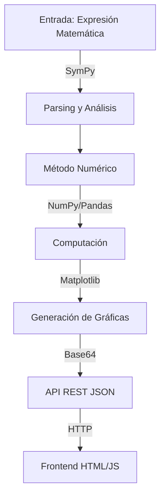
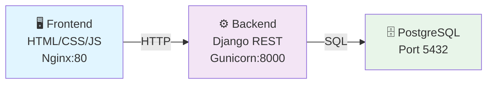
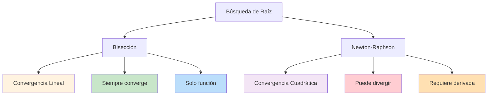
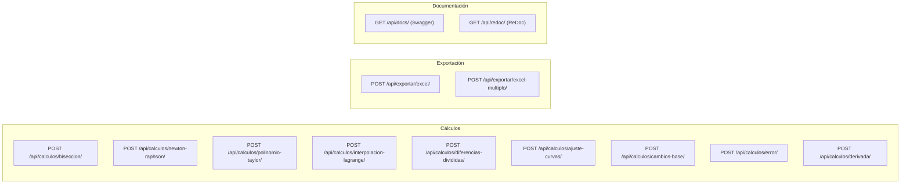
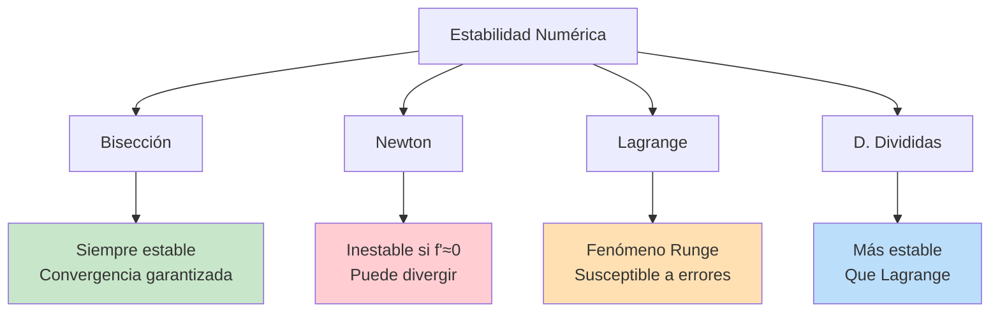

# Calculadora de Métodos Numéricos

Aplicación web completa que implementa **9 métodos numéricos** para resolución de problemas matemáticos comunes en análisis numérico. Backend REST API con Django + PostgreSQL, frontend HTML/JavaScript, y orquestación Docker.

---

## Descripción General

Esta aplicación procesa **expresiones matemáticas simbólicas**, las evalúa numéricamente y retorna resultados junto con:
- Visualizaciones gráficas en formato PNG (codificadas en base64)
- Historial detallado de iteraciones
- Exportación de datos a Excel

### Características Principales



---

## Arquitectura del Proyecto



### Stack Tecnológico

| Capa | Tecnología | Versión | Función |
|------|------------|---------|---------|
| **Backend** | Django + DRF | 4.2.13 + 3.14.0 | API REST |
| **Procesamiento** | SymPy | 1.12 | Álgebra simbólica |
| **Numeración** | NumPy | 1.24.3 | Operaciones numéricas |
| **Gráficas** | Matplotlib | 3.7.2 | Visualización PNG |
| **Datos** | Pandas + openpyxl | 2.0.3 + 3.1.2 | Exportación Excel |
| **Base de Datos** | PostgreSQL | 15 | Persistencia |
| **Orquestación** | Docker Compose | - | Containerización |

---

## Métodos Matemáticos Implementados

### 1️⃣ Método de Bisección

**Propósito:** Encontrar una raíz real de $f(x) = 0$ en $[a, b]$

**Teoría Matemática:**

El método se basa en el **Teorema de Bolzano**: si $f$ es continua en $[a, b]$ y $f(a) \cdot f(b) < 0$, entonces existe $c \in (a, b)$ tal que $f(c) = 0$.

**Algoritmo:**

$$p_n = \frac{a_n + b_n}{2} \quad \text{(punto medio)}$$

En cada iteración se reduce el intervalo:

$$\text{Si } f(a_n) \cdot f(p_n) < 0 \implies [a_{n+1}, b_{n+1}] = [a_n, p_n]$$
$$\text{Si } f(a_n) \cdot f(p_n) > 0 \implies [a_{n+1}, b_{n+1}] = [p_n, b_n]$$

**Error Relativo:**

$$E_{\text{rel}} = \frac{|x_{n+1} - x_n|}{|x_{n+1}|} < \varepsilon$$

**Características:**
- Convergencia garantizada
- Complejidad: $O(\log((b-a)/\varepsilon))$
- Generación dual: gráfica de función + convergencia del error

---

### 2️⃣ Método de Newton-Raphson

**Propósito:** Encontrar raíces con convergencia cuadrática

**Fórmula de Recurrencia:**

$$x_{n+1} = x_n - \frac{f(x_n)}{f'(x_n)}$$

**Interpretación Geométrica:** La tangente a $f$ en $(x_n, f(x_n))$ intersecta el eje $x$ en $x_{n+1}$.

**Derivada Simbólica:**

$$f'(x) = \frac{d}{dx}[f(x)] \quad \text{(calculada por SymPy)}$$

**Convergencia Cuadrática:**

$$|e_{n+1}| \approx C \cdot |e_n|^2$$

**Condiciones:**
- $f'(x_0) \neq 0$
- Error relativo: $\frac{|x_{n+1} - x_n|}{|x_{n+1}|} < \varepsilon$

**Comparativa con Bisección:**



---

### 3️⃣ Polinomio de Taylor

**Propósito:** Aproximar $f(x)$ mediante un polinomio de grado $n$ alrededor del punto $c$

**Serie de Taylor:**

$$P_n(x) = \sum_{k=0}^{n} \frac{f^{(k)}(c)}{k!}(x - c)^k$$

**Propiedades:**
- Coincide en el punto: $P_n(c) = f(c)$
- Derivadas coinciden: $P_n^{(k)}(c) = f^{(k)}(c)$ para $k = 0, 1, \ldots, n$

**Error de Aproximación:**

$$|f(x) - P_n(x)| \leq \frac{M_{n+1}}{(n+1)!}|x - c|^{n+1}$$

donde $M_{n+1}$ es una cota de $|f^{(n+1)}(t)|$ en el intervalo.

**Salida:**
- Valor exacto $f(x_0)$
- Valor aproximado $P_n(x_0)$
- Error absoluto y relativo
- Gráfica comparativa

---

### 4️⃣ Interpolación de Lagrange

**Propósito:** Encontrar polinomio que pasa por puntos $(x_i, y_i)$

**Polinomio de Lagrange de Grado $n-1$:**

$$P(x) = \sum_{i=0}^{n-1} y_i \cdot L_i(x)$$

**Base de Lagrange:**

$$L_i(x) = \prod_{j=0, j \neq i}^{n-1} \frac{x - x_j}{x_i - x_j}$$

**Propiedades:**
- Pasa exactamente por todos los puntos: $P(x_i) = y_i$
- Único de grado mínimo que interpola los puntos
- Complejidad: $O(n^2)$

**Desventajas:**
- Fenómeno de Runge: oscilaciones en extremos
- Inestabilidad con puntos muy cercanos

---

### 5️⃣ Diferencias Divididas de Newton

**Propósito:** Interpolación con actualizaciones incrementales

**Polinomio de Newton:**

$$P(x) = c_0 + c_1(x-x_0) + c_2(x-x_0)(x-x_1) + \cdots$$

**Tabla de Diferencias Divididas:**

$$\begin{array}{c|c|c|c}
x_i & f[x_i] & f[x_i, x_{i+1}] & f[x_i, x_{i+1}, x_{i+2}] \\
\hline
x_0 & y_0 & \frac{y_1-y_0}{x_1-x_0} & \cdots \\
x_1 & y_1 & \frac{y_2-y_1}{x_2-x_1} & \cdots \\
x_2 & y_2 & \cdots & \\
\end{array}$$

**Ventajas vs Lagrange:**
- Actualización incremental (agregar punto = una fila más)
- Mejor estabilidad numérica
- Coeficientes directos
- Complejidad: $O(n^2)$ vs $O(n^3)$ Lagrange

---

### 6️⃣ Ajuste de Curvas por Mínimos Cuadrados

**Propósito:** Encontrar la curva que mejor aproxima puntos dispersos

**Criterio de Optimización:**

Minimizar: $S = \sum_{i=1}^{m} (y_i - \hat{y}_i)^2$

#### a) Ajuste Polinómico de Grado $n$

$$y = a_0 + a_1x + a_2x^2 + \cdots + a_nx^n$$

Resuelve sistema normal: $(X^T X) \mathbf{a} = X^T \mathbf{y}$

#### b) Ajuste Exponencial

**Modelo:** $y = ae^{bx}$

**Transformación logarítmica:** $\ln(y) = \ln(a) + bx$

Se resuelve como regresión lineal en escala log.

#### c) Ajuste Logarítmico

**Modelo:** $y = a + b\ln(x)$ (requiere $x > 0$)

**Métricas de Bondad:**

| Métrica | Fórmula | Interpretación |
|---------|---------|----------------|
| $R^2$ | $1 - \frac{SSR}{SST}$ | $R^2 = 1$: ajuste perfecto |
| RMSE | $\sqrt{\frac{SSR}{n}}$ | Error medio cuadrático |
| $s$ | $\sqrt{\frac{SSR}{n-2}}$ | Desviación estándar residuos |

---

### 7️⃣ Cálculos Auxiliares

#### Cálculo de Errores

$$E_{\text{abs}} = |x_{\text{verdadero}} - x_{\text{aprox}}|$$

$$E_{\text{rel}} = \frac{E_{\text{abs}}}{|x_{\text{verdadero}}|}$$

$$E_{\text{pct}} = E_{\text{rel}} \times 100\%$$

#### Derivadas Simbólicas

Cálculo exacto mediante SymPy:

$$\frac{d}{dx}[x^2 + 3x] = 2x + 3$$

#### Cambios de Base

Conversion entre bases $2 \to 36$:
- Base N a Base 10: evaluación polinómica
- Base 10 a Base N: algoritmo división/multiplicación

---

## Endpoints de la API



### Ejemplo de Respuesta

```json
{
  "raiz": 1.41421356,
  "iteraciones": 20,
  "tolerancia": 0.0001,
  "historial": [
    {
      "iteracion": 1,
      "a": 0.0,
      "b": 2.0,
      "p_n": 1.0,
      "f_p_n": -1.0,
      "error_relativo": 1.0
    }
  ],
  "grafica_png": "iVBORw0KGgoAAAANSUhEUgAAA..."
}
```

---

## Estructura del Proyecto

```
Simulaci-n_Proyecto_Final/
├── backend/django_api/
│   ├── config/
│   │   ├── settings.py
│   │   ├── urls.py
│   │   └── wsgi.py
│   ├── apps/calculadora/
│   │   ├── services/          # Lógica numérica
│   │   │   ├── evaluador.py
│   │   │   ├── biseccion.py
│   │   │   ├── newton_raphson.py
│   │   │   ├── polinomio.py
│   │   │   ├── interpolacion_lagrange.py
│   │   │   ├── diferencias_divididas.py
│   │   │   ├── ajuste_curvas.py
│   │   │   ├── cambios_base.py
│   │   │   └── metodo_numerico.py
│   │   ├── views/             # Endpoints
│   │   │   ├── biseccion.py
│   │   │   ├── newton_raphson.py
│   │   │   ├── taylor.py
│   │   │   ├── interpolacion_lagrange.py
│   │   │   ├── diferencias_divididas.py
│   │   │   ├── ajuste_curvas.py
│   │   │   ├── cambios_base.py
│   │   │   ├── error.py
│   │   │   ├── derivada.py
│   │   │   ├── export.py
│   │   │   └── api_root.py
│   │   ├── serializers/
│   │   └── migrations/
│   ├── Dockerfile
│   ├── requirements.txt
│   └── entrypoint.sh
├── frontend/
│   ├── index.html
│   ├── css/style.css
│   ├── pages/
│   │   ├── biseccion.html
│   │   ├── newton.html
│   │   ├── taylor.html
│   │   └── ...
│   └── Dockerfile
├── docker-compose.yml
├── .env
└── README.md
```

---

## Instalación y Ejecución

### Requisitos Previos

- Docker y Docker Compose instalados
- Puertos 80 (frontend) y 8000 (backend) disponibles

### Pasos de Instalación

```bash
# 1. Navegar al directorio del proyecto
cd "Simulaci-n_Proyecto_Final"

# 2. Construir e iniciar contenedores
docker compose up --build -d

# 3. Esperar a inicialización (90-120 segundos)

# 4. Acceder a la aplicación
# Frontend: http://localhost/
# Swagger API: http://localhost:8000/api/docs/
# ReDoc API: http://localhost:8000/api/redoc/

# 5. Detener la aplicación
docker compose down
```

---

## Uso

### Opción 1: Frontend Web

```
1. Navegar a http://localhost/
2. Seleccionar método
3. Ingresar parámetros
4. Visualizar gráficas
5. Descargar Excel
```

### Opción 2: API REST (Postman)

```bash
curl -X POST http://localhost:8000/api/calculos/biseccion/ \
  -H "Content-Type: application/json" \
  -d '{
    "expresion": "x**2 - 2",
    "a_inicial": 0,
    "b_inicial": 2,
    "tolerancia": 0.0001
  }'
```

---

## Características Técnicas

### Procesamiento de Expresiones

- SymPy para parsing y validación
- Soporte: `+`, `-`, `*`, `/`, `**`, funciones trigonométricas
- Transformación automática: `^` → `**`
- Manejo de excepciones para expresiones inválidas

### Generación de Gráficas

- Matplotlib: creación y renderización
- Base64 PNG: transmisión sin almacenamiento
- Resolución: 100 DPI, formato optimizado
- Múltiples subgráficas por análisis

### Exportación de Datos

- Excel (.xlsx) con Pandas/openpyxl
- Base64 para transmisión
- Múltiples hojas por archivo
- Inferencia automática de columnas

---

## Notas Académicas

### Métodos Numéricos vs Analíticos

| Aspecto | Numérico | Analítico |
|---------|----------|-----------|
| Complejidad | Cualquier función | Funciones simples |
| Precisión | Aproximado | Exacto |
| Implementación | Iterativo | Directo |
| Tiempo | Más lento | Más rápido |
| Generalidad | Alta | Baja |

### Estabilidad Numerica



### Precisión Numérica

- Tolerancia predeterminada: $\varepsilon = 0.0001$
- Precisión IEEE 754: 15-17 dígitos significativos
- Visualización: 6 decimales en interfaz

---

## Dificultades Resueltas

| Problema | Solución |
|----------|----------|
| Graficas sin DB | Base64 en respuesta JSON |
| Excel sin almacenamiento | Buffer en memoria + Base64 |
| Expresiones dinámicas | SymPy para parsing/derivada |
| Multiples métodos | Endpoints separados por método |
| Convergencia lenta | Tolerancia ajustable |

---

## Conclusiones

Esta aplicación demuestra la **implementación práctica** de métodos numéricos fundamentales
en análisis numérico. La arquitectura separa claramente:

- **Servicios**: Lógica numérica pura
- **Vistas**: Endpoints REST stateless
- **Frontend**: Consumidor de API

El uso de **Docker** asegura portabilidad y reproducibilidad. La **documentación Swagger** 
facilita integración y pruebas. El enfoque **sin autenticación** es apropiado para contexto 
académico.

Criterio de Convergencia:
- Error relativo: |x_n+1 - x_n| / |x_n+1| < tolerancia
- Numero maximo de iteraciones para evitar bucles infinitos

Complejidad: O(log(b-a/tol)) iteraciones

Implementacion:
- Archivo: backend/django_api/apps/calculadora/services/biseccion.py
- Generacion de grafica con dos subgraficas: funcion + raiz y convergencia del error
- Retorna historial detallado de cada iteracion

2. METODO DE NEWTON-RAPHSON

Proposito: Encontrar una raiz de f(x) = 0 con convergencia cuadratica.

Teoria Matematica:
- Formula de recurrencia: x_n+1 = x_n - f(x_n) / f'(x_n)
- Requiere evaluacion de la derivada en cada iteracion
- La derivada se calcula simbolicamente usando SymPy: f'(x) = d/dx[f(x)]
- Interpretacion geometrica: la linea tangente a f en (x_n, f(x_n)) intersecta 
  el eje x en x_n+1

Condiciones de Convergencia:
- f'(x_0) != 0 (la derivada no puede ser cero en el punto inicial)
- Error relativo: |x_n+1 - x_n| / |x_n+1| < tolerancia
- La convergencia es cuadratica cerca de la raiz: |e_n+1| ~ C * |e_n|^2

Comparacion con Biseccion:
- Newton converge mucho mas rapidamente (cuadratica vs lineal)
- Requiere la derivada, mientras que Biseccion solo necesita la funcion
- Newton puede divergir si el punto inicial es mal elegido
- Biseccion garantiza convergencia si se cumple Bolzano

Implementacion:
- Archivo: backend/django_api/apps/calculadora/services/newton_raphson.py
- Calculo simbolico de derivada con SymPy
- Grafica muestra tangentes de las primeras iteraciones
- Manejo de error cuando f'(x_n) = 0

3. POLINOMIO DE TAYLOR

Proposito: Aproximar una funcion f(x) mediante un polinomio alrededor de un punto.

Teoria Matematica:
- Serie de Taylor de grado n alrededor del punto c:
  P_n(x) = sum_{k=0}^{n} [ f^(k)(c) / k! * (x - c)^k ]
  
- Componentes:
  * f^(k)(c) es la k-esima derivada de f evaluada en c
  * k! es el factorial de k
  * (x - c)^k es la potencia del desplazamiento

- Propiedades:
  * El polinomio coincide con f en el punto c: P_n(c) = f(c)
  * Las primeras n derivadas coinciden: P_n^(k)(c) = f^(k)(c) para k = 0, 1, ..., n
  * Error de aproximacion: |f(x) - P_n(x)| <= M_{n+1} * |x - c|^{n+1} / (n+1)!
    donde M_{n+1} es una cota de |f^(n+1)(t)| en el intervalo

Implementacion:
- Archivo: backend/django_api/apps/calculadora/services/polinomio.py
- Calculo de coeficientes usando derivadas simbolicas
- Comparacion entre valor exacto y aproximacion de Taylor
- Grafica muestra funcion original y aproximacion

4. INTERPOLACION DE LAGRANGE

Proposito: Encontrar un polinomio que pasa por puntos dados (x_i, y_i).

Teoria Matematica:
- Polinomio de Lagrange de grado n-1 para n puntos:
  P(x) = sum_{i=0}^{n-1} [ y_i * L_i(x) ]
  
- Donde L_i(x) es el polinomio de base de Lagrange:
  L_i(x) = product_{j=0, j!=i}^{n-1} [ (x - x_j) / (x_i - x_j) ]
  
- Propiedades:
  * Pasa exactamente por todos los puntos dados: P(x_i) = y_i
  * Grado = numero de puntos - 1
  * Es el unico polinomio de grado minimo que interpola los puntos
  * Evaluacion eficiente: O(n^2) operaciones para n puntos

Desventajas:
- El fenomeno de Runge: oscilaciones en los extremos con muchos puntos
- Inestabilidad numerica con puntos muy cercanos
- Requiere conocer todos los puntos de antemano

Implementacion:
- Archivo: backend/django_api/apps/calculadora/services/interpolacion_lagrange.py
- Calculo de L_i(x) para cada punto
- Grafica muestra puntos originales y polinomio interpolante
- Retorna valor interpolado en punto de evaluacion

5. DIFERENCIAS DIVIDIDAS DE NEWTON

Proposito: Interpolacion polinomial alternativa con actualizaciones incrementales.

Teoria Matematica:
- Polinomio de Newton: P(x) = c_0 + c_1*(x-x_0) + c_2*(x-x_0)*(x-x_1) + ...
  
- Coeficientes por diferencias divididas:
  c_k = f[x_0, x_1, ..., x_k] (diferencia dividida de orden k)
  
- Tabla de diferencias divididas:
  f[x_i] = y_i                                    (orden 0)
  f[x_i, x_i+1] = (f[x_i+1] - f[x_i]) / (x_i+1 - x_i)   (orden 1)
  f[x_i, x_i+1, x_i+2] = (f[x_i+1, x_i+2] - f[x_i, x_i+1]) / (x_i+2 - x_i)  (orden 2)
  
- Ventajas sobre Lagrange:
  * Actualizacion incremental: agregar un punto solo requiere calcular una fila mas
  * Mejor estabilidad numerica
  * Coeficientes directos sin resolver sistema de ecuaciones
  * Menor costo computacional: O(n^2) vs O(n^3) de Lagrange

Implementacion:
- Archivo: backend/django_api/apps/calculadora/services/diferencias_divididas.py
- Construccion de tabla de diferencias divididas
- Evaluacion de polinomio de Newton eficiente
- Grafica muestra polinomio interpolante y tabla de diferencias

6. AJUSTE DE CURVAS POR MINIMOS CUADRADOS

Proposito: Encontrar la curva (polinomial, exponencial, logaritmica) que mejor 
aproxima un conjunto de puntos con ruido o dispersos.

Teoria Matematica:

a) Ajuste Polinomico de Grado n:
   - Modelo: y = a_0 + a_1*x + a_2*x^2 + ... + a_n*x^n
   - Criterio: minimizar sum_{i=1}^{m} (y_i - y_pred_i)^2
   - Resuelve sistema normal: (X^T * X) * a = X^T * y
   - Coeficientes obtenidos por np.polyfit()

b) Ajuste Exponencial:
   - Modelo: y = a * exp(b*x)
   - Transformacion logaritmica: ln(y) = ln(a) + b*x
   - Se resuelve como regresion lineal en escala log
   - Coeficientes: a = exp(intercept), b = pendiente

c) Ajuste Logaritmico:
   - Modelo: y = a + b*ln(x)
   - Transformacion: y = a + b*ln(x) (regresion lineal directa)
   - Requiere x > 0 para todos los puntos

Metricas de Bondad del Ajuste:
- Suma de cuadrados residuales (SSR): sum(residuos^2)
- Suma total de cuadrados (SST): sum((y - media(y))^2)
- Coeficiente de determinacion (R^2) = 1 - SSR/SST
  * R^2 = 1: ajuste perfecto
  * R^2 = 0: el modelo no explica variabilidad
  * R^2 negativo: modelo peor que la media
  
- Error cuadratico medio (RMSE): sqrt(SSR / n)
- Desviacion estandar de residuos: std(residuos)

Implementacion:
- Archivo: backend/django_api/apps/calculadora/services/ajuste_curvas.py
- Soporte para tres tipos de ajuste
- Retorna coeficientes, ecuacion, R^2, RMSE y desviacion estandar
- Grafica muestra puntos reales, curva ajustada y residuos

7. CALCULOS AUXILIARES

a) Cálculo de Errores:
   - Error absoluto: E_abs = |valor_verdadero - valor_aproximado|
   - Error relativo: E_rel = E_abs / |valor_verdadero|
   - Error porcentual: E_pct = E_rel * 100%

b) Derivadas:
   - Calculo simbolico con SymPy
   - Retorna derivada en forma simbolica y evaluada en punto
   - Ejemplo: d/dx[x^2 + 3x] = 2x + 3

c) Cambios de Base:
   - Conversion de numeros entre bases 2, 8, 10, 16
   - Manejo de parte entera y fraccionaria por separado
   - Base N a base 10: evaluacion polinomica
   - Base 10 a base N: algoritmo de division/multiplicacion

CARACTERISTICAS TECNICAS

Procesamiento de Expresiones:
- Validacion y parsing con SymPy
- Soporte para: +, -, *, /, **, funciones trigonometricas, exp, log, sqrt, abs
- Transformacion automatica: ^ convertido a **
- Manejo de excepciones para expresiones invalidas

Generacion de Graficas:
- Matplotlib para creacion de graficas
- Codificacion PNG en base64 para transmision sin almacenamiento
- Multiples subgraficas para mostrare analisis (funcion + convergencia, etc.)
- Resolucion: 100 DPI, formato PNG optimizado

Exportacion de Datos:
- Excel (.xlsx) con Pandas y openpyxl
- Base64 para transmision sin almacenamiento
- Soporte para multiples hojas en un archivo
- Columnas: automaticamente inferidas de los datos

API REST:
- Endpoints sin autenticacion (proyecto academico)
- Documentacion Swagger interactiva en /api/docs/
- ReDoc alternativo en /api/redoc/
- Respuestas JSON estructuradas
- Manejo de errores con codigos HTTP apropiados

ESTRUCTURA DE DIRECTORIOS

Simulaci-n_Proyecto_Final/
├── backend/
│   └── django_api/
│       ├── config/
│       │   ├── settings.py        (Configuracion Django, BD, apps)
│       │   ├── urls.py            (Enrutamiento API REST)
│       │   └── wsgi.py
│       ├── apps/
│       │   └── calculadora/
│       │       ├── models.py      (Modelos Django, no usados para persistencia)
│       │       ├── views/         (Funciones vistas con @api_view)
│       │       │   ├── biseccion.py
│       │       │   ├── newton_raphson.py
│       │       │   ├── taylor.py
│       │       │   ├── interpolacion_lagrange.py
│       │       │   ├── diferencias_divididas.py
│       │       │   ├── ajuste_curvas.py
│       │       │   ├── cambios_base.py
│       │       │   ├── error.py
│       │       │   ├── derivada.py
│       │       │   ├── export.py  (Exportacion Excel)
│       │       │   └── api_root.py
│       │       ├── serializers/   (Validacion de entrada, no usada)
│       │       ├── services/      (Logica numerica)
│       │       │   ├── evaluador.py              (Parsing y evaluacion con SymPy)
│       │       │   ├── biseccion.py
│       │       │   ├── newton_raphson.py
│       │       │   ├── polinomio.py
│       │       │   ├── interpolacion_lagrange.py
│       │       │   ├── diferencias_divididas.py
│       │       │   ├── ajuste_curvas.py
│       │       │   ├── cambios_base.py
│       │       │   ├── metodo_numerico.py       (Clase base)
│       │       │   └── __init__.py
│       │       └── migrations/    (Django migrations, sin modelos persistentes)
│       ├── Dockerfile
│       ├── requirements.txt       (Dependencias Python)
│       ├── entrypoint.sh         (Script de inicio con migraciones)
│       └── manage.py
├── frontend/
│   ├── index.html
│   ├── css/
│   │   └── style.css
│   ├── pages/               (Paginas HTML para cada metodo)
│   │   ├── biseccion.html
│   │   ├── newton.html
│   │   ├── taylor.html
│   │   ├── lagrange.html
│   │   ├── diferencias-divididas.html
│   │   ├── ajuste_curvas.html
│   │   └── ...
│   ├── Dockerfile
│   └── nginx.conf           (Configuracion de servidor web)
├── docker-compose.yml       (Orquestacion: PostgreSQL, Django, Nginx, Frontend)
├── Readme.txt              (Este archivo)
└── .env                    (Variables de entorno)

INSTALACION Y EJECUCION

Prerequisitos:
- Docker y Docker Compose instalados
- Puerto 80 (frontend) y 8000 (backend) disponibles

Pasos:
1. Navegar al directorio del proyecto:
   cd "C:\Users\ASUS\Documents\UNIprogramacion\Web devoloping\Proyecto_Final_Simulacion\Simulaci-n_Proyecto_Final"

2. Construir e iniciar contenedores:
   docker compose up --build -d

3. Esperar a que inicie (90-120 segundos)

4. Acceder a la aplicacion:
   - Frontend: http://localhost/
   - API Swagger: http://localhost:8000/api/docs/
   - API ReDoc: http://localhost:8000/api/redoc/

5. Detener la aplicacion:
   docker compose down

USO

1. Mediante Frontend (HTML):
   - Navegar a http://localhost/
   - Seleccionar un metodo
   - Ingresar parametros (expresion, intervalo, puntos, etc.)
   - Visualizar resultados y graficas
   - Descargar Excel con datos

2. Mediante API REST (Postman):
   - POST http://localhost:8000/api/calculos/biseccion/
   - Headers: Content-Type: application/json
   - Body: {"expresion": "x**2 - 2", "a_inicial": 0, "b_inicial": 2}
   - Respuesta: {"raiz": 1.414..., "iteraciones": [...], "grafica_png": "base64..."}

3. Mediante Scripts en Postman:
   - Pestaña "Scripts" → "Post-response"
   - Visualizar graficas directamente en Postman
   - Exportar datos a Excel

DEPENDENCIAS PRINCIPALES

Backend:
- Django 4.2.13: Framework web
- djangorestframework 3.14.0: API REST
- drf-spectacular 0.27.0: Documentacion Swagger
- SymPy 1.12: Algebra simbolica y calculo de derivadas
- NumPy 1.24.3: Operaciones numericas
- Pandas 2.0.3: Manejo de datos tabulares
- Matplotlib 3.7.2: Generacion de graficas
- openpyxl 3.1.2: Creacion de archivos Excel
- psycopg2-binary 2.9.9: Driver PostgreSQL
- gunicorn 21.2.0: Servidor WSGI

Frontend:
- HTML5 + CSS3 + JavaScript Vanilla
- Nginx para servir archivos estaticos

NOTAS ACADEMICAS

Metodos Numericos Implementados vs Metodos Analíticos:
- Los metodos numericos aproximan soluciones que pueden no existir en forma cerrada
- Permiten resolver problemas complejos que son intratables analíticamente
- El analisis de convergencia asegura que los resultados sean confiables
- El manejo de errores es fundamental en computacion numerica

Precision Numerica:
- Tolerancia predeterminada: 0.0001 (ajustable por usuario)
- Precision de flotante: 15-17 dígitos significativos (IEEE 754)
- Redondeo mostrado a 6 decimales en interfaz

Estabilidad Numerica:
- Biseccion: siempre estable, convergencia garantizada
- Newton: convergencia rapida pero puede divergir
- Lagrange: susceptible al fenomeno de Runge
- Diferencias divididas: mas estable que Lagrange

DIFICULTADES PREVISTAS Y SOLUCIONADAS

1. Distribucion en directorios separados:
   - Resuelto: /views/ y /serializers/ separados por componente

2. Generacion de graficas sin almacenamiento en BD:
   - Resuelto: codificacion en base64, transmision en respuesta JSON

3. Exportacion de Excel sin persistencia:
   - Resuelto: generacion en buffer, codificacion en base64

4. Evaluacion simbolica de expresiones:
   - Resuelto: uso de SymPy para parsing y calculo de derivadas

5. Multiples metodos en una sola API:
   - Resuelto: endpoints separados por metodo, logica compartida en /services/

CONCLUSIONES

Esta aplicacion demuestra la implementacion practica de metodos numericos 
fundamentales en analisis numerico. La arquitectura separa claramente la 
logica de negocio (servicios numericos), la presentacion (API REST), y la 
interfaz de usuario (frontend HTML). El uso de Docker asegura portabilidad 
y reproducibilidad del entorno. La documentacion interactiva (Swagger) 
facilita la integracion y prueba de la API.
